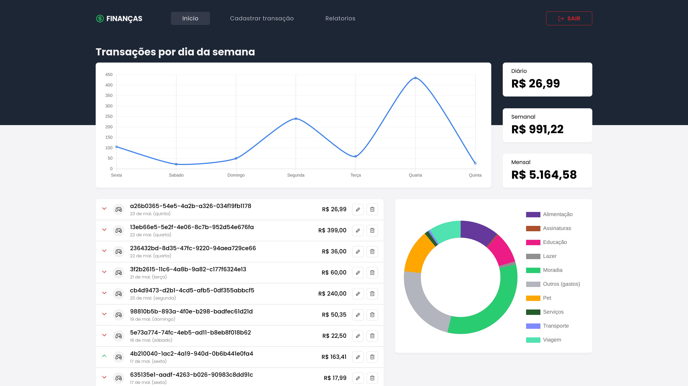

<p align="center">
  DIM DIM CONTROLLER
</p>

<p align="center">
  
  
  
  
  

  <a href="https://github.com/leovargasdev/dim-dim-controller/commits/master">
    
  </a>
  
  <a href="https://github.com/leovargasdev/dim-dim-controller/issues">
    
  </a>
</p>



## 💻 Projeto

Aplicação de controle financeiro. [Figma](https://www.figma.com/file/byYsxEB9LCRpG7AW2mkicr/App-Finance?type=design&node-id=4%3A9&mode=dev)

## 🚀 Tecnologias

-  [NextJS](https://nextjs.org/)
-  [Sass](https://sass-lang.com/)
-  [TypeScript](https://www.typescriptlang.org/)
-  [Radix UI](https://www.radix-ui.com/)
-  [React Hook Form](https://react-hook-form.com/)
-  [Zod](https://zod.dev/)
-  [Firebase](https://firebase.google.com/)

Também foi adicionado as ferramentas [**ESLint**](https://eslint.org/) e [**Prettier**](https://prettier.io/) para aumentar a produtividade e auxiliar a manter um padrão de código.

## 📝 Funcionalidade à fazer

- [ ] Autenticação (google, github)
- [ ] Cadastro de usuário
- [ ] Vincular um usuário a uma transação
- [ ] Listar as transações
- [ ] Remover uma transação

## 📥 Rodando localmente

Clone o projeto

```bash
  git clone https://github.com/leovargasdev/br-challenges
```

Entre no diretório do projeto

```bash
  cd br-challenges
```

Instale as dependências

```bash
  yarn install
```

Inicie o servidor

```bash
  yarn next
```

**PS: Configurar as variáveis ambientes do arquivo `env.example`.**

